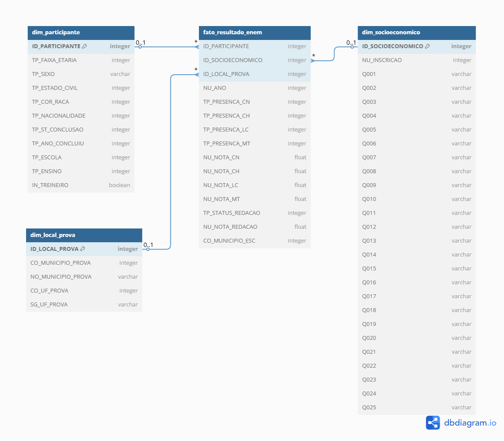

# ETL e Análise dos Microdados do ENEM 2023

Este projeto foi desenvolvido como projeto final da sprint de Engenharia de Dados do curso de pós graduação em Ciência de Dados e Analytics pela PUC Rio de Janeiro. Em relação à estrutura de dados, faz-se a construção de um Data Warehouse baseado nos Microdados do ENEM 2023 (versão mais recente disponível), utilizando o modelo dimensional Estrela e Spark. O objetivo principal é fornecer informações sobre como as notas se distrubuem de acordo com fatores como UF, sexo, raça e ano de conclusão do ensino médio. Além disso, possibilitar análises dentro do questionário socioeconônimo como as relacionadas a renda familiar e nível de escolaridade dos pais.

O projeto foi desenvolvidos através do Databricks Community, com os dados armazenados no Google Drive (após estração do site oficial). Estão presentes nesse repositório o notebook com o pipeline do **ETL** ([link para o .ipynb](https://github.com/mgabrielarn/enem__data_analysis/blob/main/src/ETL.ipynb)), o notebook com as análises e o **catálogo de dados** ([link para o .md](https://github.com/mgabrielarn/enem__data_analysis/blob/main/src/data_catalog.md)).

---
## Objetivo

O Exame Nacional do Ensino Médio, ENEM, é uma das principais ferramentas de avaliação da educação no Brasil. Por ser aplicado em todo o país, para todos os tipos de escola, para estudantes de alta e baixa renda dentre outros fatores, é uma poderosa ferramenta para entender desigualdades na qualidade do ensino que recebem.

Diferentes fatores, além dos explorados na análise, podem contribuir para as notas dos estudantes no exame mas se espera que ao observar o comportamento agrupado de todos eles possamos entender o cenário e responder algumas perguntas relacionadas como:
1. Existem diferenças significativas nos desempenhos de estudantes do sexo masculino e feminino?
2. Existem diferenças significativas nos desempenhos de estudantes de acordo com sua cor/raça/etnia?
3. Existem diferenças significativas nos desempenhos de estudantes de acordo com o tipo da escola que frenquentaram?
4. Existem diferenças significativas nos desempenhos de estudantes de acordo com sua Unidade da Federação?
5. Existem diferenças significativas nos desempenhos de estudantes de acordo com o nível de escolaridade que seus pais recebram?
6. Existe um perfil claro dentre os alunos com melhores performances?

---
## Fonte dos Dados

- **Microdados ENEM 2023**  
  Instituto Nacional de Estudos e Pesquisas Educacionais Anísio Teixeira (INEP)
  [https://www.gov.br/inep/pt-br/acesso-a-informacao/dados-abertos/microdados/enem](https://www.gov.br/inep/pt-br/acesso-a-informacao/dados-abertos/microdados/enem)

---

## Esquema Estrela

**Fato:**
- `fato_resultado_enem`: notas, presenças, status da redação

**Dimensões:**
- `dim_participante`: dados pessoais e escolares
- `dim_socioeconomico`: respostas ao questionário socioeconômico
- `dim_local_prova`: informações sobre o local da prova

---
## Autoavaliação

lorem ips
---

## Documentação

- `/src/catalogo_de_dados.md`: Catálogo de dados com descrições, domínios e linhagem

---

## Licença

Este projeto é de uso educacional.  
Os dados utilizados são públicos e disponibilizados pelo INEP.
